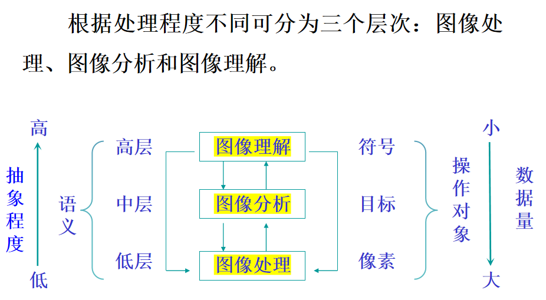
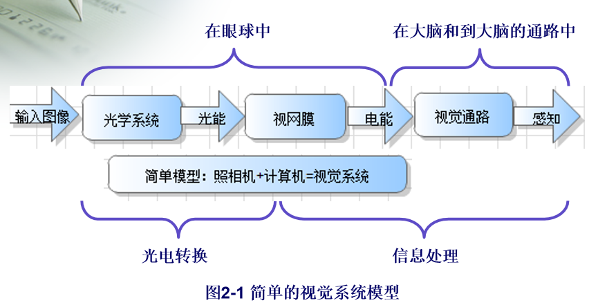

# 填空

#### 1.图像技术的三个层次

图像理解、图像分析、图像处理

低级：输入、输出都是图像。例如：图像去噪、对比度增强等。
中级：输入通常是图像，输出为从图像中提取的属性，如边缘、轮廓等。
高级：高级处理通过执行与人类视觉相关的感知函数，例如：图像的识别

#### 2.视觉系统模型

#### 3.锥状细胞与杆状细胞

锥状细胞：白天 感知颜色 在高照度识别细节(明视觉)

杆状细胞：夜晚 感知亮度 在低照度识别形状和运动(暗视觉)

#### 函数的不同类型

#### 图像压缩的三种冗余

#### 人眼机制

 瞳孔-光圈
 晶状体-变焦透镜
 角膜-聚光
 视网膜-底片

#### 色彩的基本属性

#### 图像理解的应用

1. 人脸识别：

- 常见技术
- 应用场景
- 研究现状
- 未来展望

2. 图像识别分析
3. 辅助驾驶
4. 医疗影像诊断
5. 图像及视频编辑
6. 图像处理

#### 其他

1. 数字图像处理 是对数字化图像进行处理的方法和技术，目的是对图像中的信息获取和理解。
2. 图像理解image understanding IU：是对图像的语义理解。以图像为对象，知识为核心，研究图像中的目标及目标之间的互相关系、图像的场景及如何应用场景。
3. 当前，图像处理提供了低光照增强、图像去雾、超分图像重建3个子服务
4. 视觉传导通路的三级神经元：视网膜的双极细胞、节细胞、神经细胞
5. 色彩的基本属性：亮度、色调、饱和度
6. 发射光三原色：红绿蓝(RGB)
7. 反射光三原色：蓝绿、品红、黄 (CMY)
8. RGB颜色模型开始