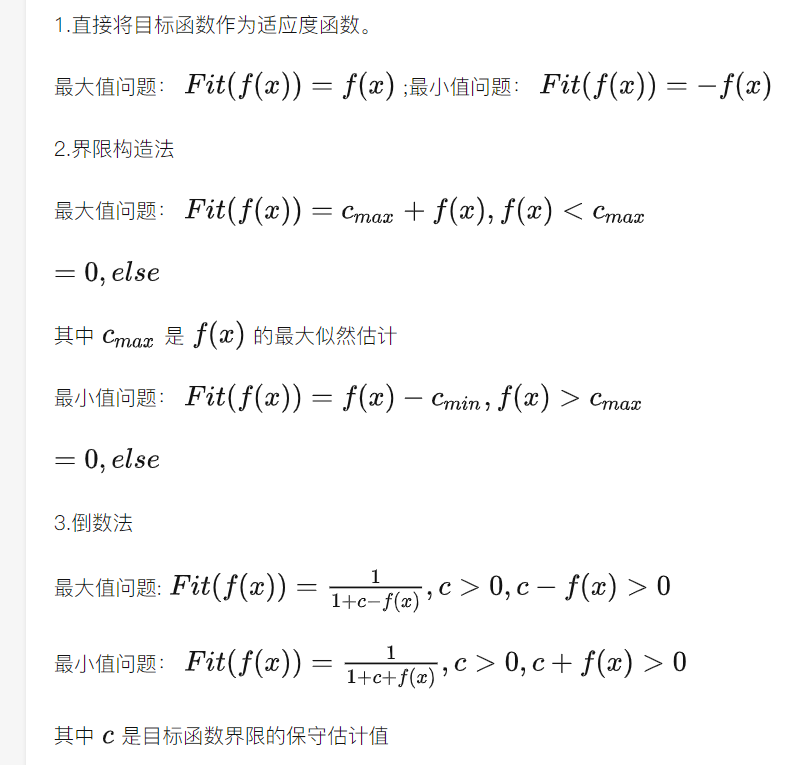

# 遗传算法

## 1.遗传算法的优势

多峰、非连续、多目标函数

## 2.爬山法

爬山法（Hill Climbing）是一种简单而常用的优化算法，用于解决局部最优化问题。它的基本思想是通过逐步改进当前解的邻域解来搜索更优的解。以下是爬山法的一般过程：

1. 初始化：随机生成或指定一个初始解作为当前解。

2. 评估当前解：计算当前解的目标函数值或评估指标。

3. 邻域搜索：对当前解进行邻域搜索，即在当前解的周围生成一组邻域解。

4. 选择最优解：从邻域解中选择具有更好目标函数值或评估指标的解作为新的当前解。

5. 终止条件判断：检查是否满足终止条件，例如达到最大迭代次数、目标函数值收敛等。

6. 如果不满足终止条件，返回步骤2；否则，输出当前解作为算法的结果。

爬山法的优点包括：

1. 简单易实现：爬山法是一种简单且易于理解和实现的优化算法，无需复杂的数学推导和大量的参数设置。

2. 局部搜索能力：爬山法能够在当前解的局部邻域内搜索，找到相对较优的解。

3. 快速收敛：由于只关注当前解的邻域，爬山法通常可以快速收敛到局部最优解。

然而，爬山法也存在一些缺点：

1. 局部最优解：由于爬山法只关注当前解的邻域，容易陷入局部最优解而无法跳出。

2. 依赖初始解：爬山法的结果很大程度上取决于初始解的选择，不同的初始解可能导致不同的最终结果。

3. 缺乏全局搜索能力：爬山法缺乏全局搜索策略，无法保证找到全局最优解。

4. 受噪声干扰：爬山法对噪声和局部扰动比较敏感，可能导致收敛到次优解。

因此，爬山法通常适用于简单的优化问题和问题空间较小的情况。对于复杂的问题或包含多个局部最优解的问题，可能需要结合其他优化算法或启发式方法来改进搜索能力和结果质量。

## 3.新达尔文主义

## 4.遗传算法的框架

遗传算法是一种基于进化原理的优化算法，主要用于解决复杂的优化问题。它通过模拟自然界的进化过程，通过遗传操作（如选择、交叉和变异）来逐代地优化候选解。下面是遗传算法的一般框架：

1. 初始化种群：随机生成一组初始个体（解）作为初始种群。每个个体表示问题的一个候选解。

2. 评估适应度：对每个个体计算适应度值，用于衡量其优劣程度。适应度函数根据具体问题的目标定义，可以是最大化或最小化目标函数。

3. 选择操作：从当前种群中选择一部分个体作为父代。选择操作的目标是基于个体的适应度值，使适应度较高的个体有更高的概率被选中。

4. 交叉操作：对选中的父代个体进行交叉操作，产生新的后代个体。交叉操作模拟基因的交叉组合，通过交换、重组个体的染色体来生成新的个体。

5. 变异操作：对产生的后代个体进行变异操作，引入随机性。变异操作模拟基因的突变，通过改变个体染色体中的部分基因来产生多样性。

6. 评估适应度：对新生成的后代个体计算适应度值。

7. 更新种群：根据选择的策略，将父代个体和后代个体合并为新的种群。

8. 终止条件判断：检查是否满足终止条件，例如达到最大迭代次数或找到满足要求的解等。

9. 如果不满足终止条件，返回步骤3；否则，输出最优解或最优解的近似值作为算法的结果。

需要注意的是，遗传算法的性能和效果受到许多参数的影响，例如种群大小、交叉率、变异率等。这些参数需要根据具体问题进行调优和设置，以获得更好的算法性能。

此外，遗传算法可以与其他优化算法或问题特定的启发式方法相结合，以进一步提高解的质量和算法的效率。根据问题的特性和要求，可以对遗传算法进行定制和改进，以满足实际应用的需求。

## 5.遗传算法的五大问题

## 6.遗传算法与经典算法的比较

## 7.编码

#### 计算编码长度

#### 解空间与码空间

#### 编码的原则

可行性、合法性、唯一性

## 8.适应度函数

#### 定义

如何建立适应度函数:

最大问题、最小问题的转换方式

#### 变换

## 9.选择

#### 选择压力

定义

推导

选择压力较大时：容易陷入局部最优
选择压力较小时：收敛慢

#### 选择方式

1. 随机
   
随机采样

轮盘赌

1. 确定

2. 混合

#### 交叉和变异

